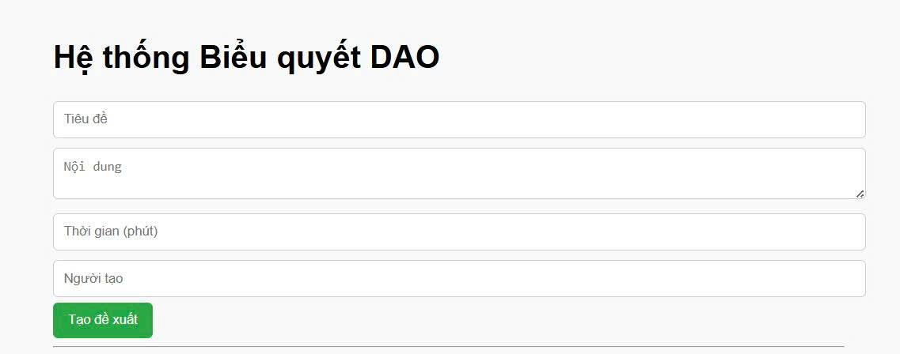
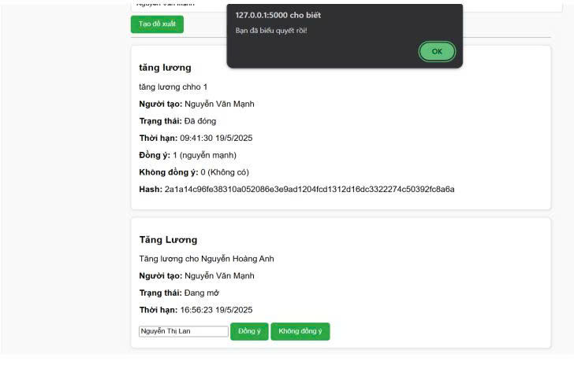
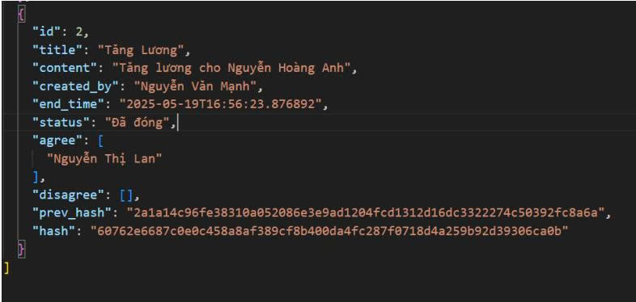

1. Mục tiêu xây dựng hệ thống

Hệ thống biểu quyết DAO được phát triển nhằm xây dựng một nền tảng bỏ phiếu minh bạch, an toàn, và không thể can thiệp sau khi đã bỏ phiếu, dựa trên mô hình chuỗi khối (blockchain) đơn giản. Ứng dụng được thiết kế phục vụ cho các tổ chức, nhóm cộng đồng hoặc cá nhân có nhu cầu:

Tạo và quản lý các đề xuất (proposal)

Cho phép biểu quyết (vote) một cách công bằng

Đảm bảo rằng mỗi người chỉ biểu quyết một lần

Tự động đóng đề xuất sau khoảng thời gian đã định

Lưu trữ dữ liệu theo chuỗi blockchain nhằm đảm bảo tính toàn vẹn và không thể chỉnh sửa

2. Kiến trúc hệ thống
2.1. Sơ đồ kiến trúc tổng quát
   
+------------------------+
|     Giao diện Web      |
| (HTML, CSS, JavaScript)|
+-----------+------------+
            |
         Giao tiếp
         (AJAX/Fetch)
            |
+------------------------+
|   Flask Backend (Python) |
+-----------+------------+
            |
   Đọc / ghi file JSON
            |
+------------------------+
|    proposals.json      |
| (giả lập chuỗi khối)   |
+------------------------+

2.2. Thành phần chính

Backend	Flask (Python):	Quản lý logic xử lý tạo đề xuất, biểu quyết

Frontend	HTML, CSS, JavaScript (AJAX):	Giao diện nhập liệu, hiển thị kết quả biểu quyết

Cơ sở dữ liệu	JSON file (proposals.json):	Lưu trữ chuỗi các đề xuất dạng blockchain

Bảo mật dữ liệu	SHA-256 Hash + prev_hash:	Đảm bảo toàn vẹn và minh bạch cho từng đề xuất

3. Chức năng của hệ thống
   
3.1. Tạo đề xuất mới

Người dùng có thể tạo đề xuất với các trường thông tin:

Tiêu đề đề xuất

Nội dung chi tiết

Thời gian tồn tại (tính bằng phút)

Tên người tạo đề xuất

3.2. Biểu quyết đề xuất

Mỗi người có thể bầu chọn một lần duy nhất cho mỗi đề xuất.

Nếu chọn Đồng ý, tên sẽ được lưu vào danh sách agree

Nếu chọn Không đồng ý, tên được lưu vào disagree

Nếu đã bầu chọn trước đó, hệ thống sẽ từ chối (popup thông báo)

3.3. Tự động đóng đề xuất

Mỗi đề xuất có thời gian đóng tính bằng phút.

Sau khi hết thời gian, hệ thống tự đánh dấu đề xuất là "Đã đóng"

Không thể biểu quyết tiếp

Kết quả sẽ hiển thị đầy đủ: số người đồng ý, không đồng ý, trạng thái, mã hash

3.4. Lưu trữ dạng blockchain

Mỗi đề xuất (block) chứa:

prev_hash: Mã của block trước

hash: Được tạo từ nội dung của block hiện tại bằng thuật toán SHA-256

Như vậy, nếu thay đổi bất kỳ trường nào, hash sẽ sai => đảm bảo dữ liệu không bị sửa lén

👨‍💻 Tác giả Nhóm 10: Nguyễn Văn Mạnh, Hà Tiến Trường, Trần Văn Quang
